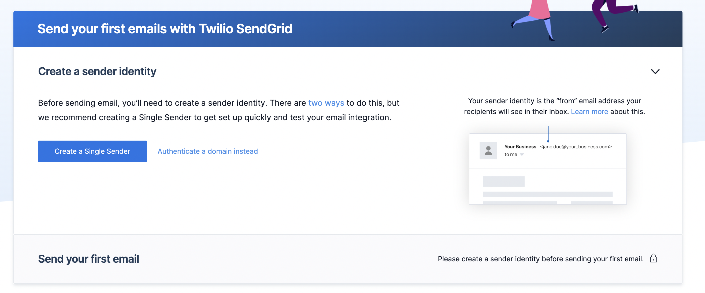
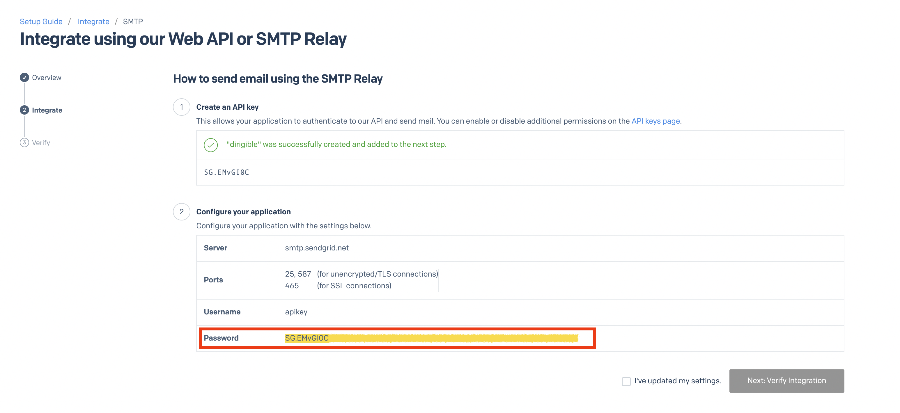

# Connecting Eclipse Dirigible with SendGrid SMTP Relay

Recent changes in **Gmail**'s policies allows **Eclipse Dirigible** users to send emails only via Workspace enabled accounts in **G Suite** and require workspace administration privileges. By connecting Eclipse Dirigible with Twilio SendGrid's SMTP Relay feature you can send emails with your personal gmail account. 

!!! note

    SendGrid is a 3rd party service and charges/limits apply. Here you can find more information about their [Email API Plans](https://sendgrid.com/pricing/?sg_product=mc). 


## Setup SendGrid Account

1. Create a SendGrid account at [https://sendgrid.com](https://sendgrid.com).
1. Login at [https://app.sendgrid.com](https://app.sendgrid.com/).
1. Verify a single sender email:

    - Click **Settings** &#8594; **Sender Authentication** &#8594; **Verify a Single Sender**.
    - Enter the details of the email address that Eclipse Dirigible mails will be sent from.

    

1. Setup SMTP Relay:

    - Click **Email API** &#8594; **Integration Guide** &#8594; **SMTP Relay**.
    - Enter an API Key Name and click **Create Key** to get an API Key for your SendGrid SMTP Relay.
    - Notice the **Configure your application** section, the credentials from it will be used to configure the mail client.
  
    

## Setup Eclipse Dirigible

!!! info "Prerequisites"

    You can follow the [Setup](https://www.dirigible.io/help/setup/) guide on how to deploy Eclipse Dirigible locally or in the cloud.

1. Add the following environment variables to your deployment:

    ```
    DIRIGIBLE_MAIL_USERNAME=apikey
    DIRIGIBLE_MAIL_PASSWORD=<YOUR_API_KEY_HERE>
    DIRIGIBLE_MAIL_TRANSPORT_PROTOCOL=smtps
    DIRIGIBLE_MAIL_SMTPS_HOST=smtp.sendgrid.net
    DIRIGIBLE_MAIL_SMTPS_PORT=465
    ```

    !!! note

        Replace the `<YOUR_API_KEY_HERE>` placeholder with the SendGrid SMTP Relay API key.

1. Restart the Eclipse Dirigible instance in order to apply the new environment variables.

!!! info "Environment Variables"

    To get a complete list of all environment variables navigate to the [Environment Variables](https://www.dirigible.io/help/setup/setup-environment-variables/) page.

## Send an Email with SendGrid SMTP Relay

1. Login to your Eclipse Dirigible instance.
1. Create new project.
1. Create new `Javascript ESM Service`.
1. Use the following sinippet to send emails:

    ```javascript
    import { client as mail } from "@dirigible/mail";
    
    const from = "<YOUR_VERIFIED_SENDER_EMAIL_HERE>";
    const to = "<YOUR_RECIPIENT_EMAIL_HERE>";
    const subject = "Subject";
    const content = "Hello World!";
    const subType = "html";
    
    mail.send(from, to, subject, content, subType);
    ```

    !!! note

        Replace the `<YOUR_VERIFIED_SENDER_EMAIL_HERE>` and the `<YOUR_RECIPIENT_EMAIL_HERE>` placeholders with valid email addresses.


    
